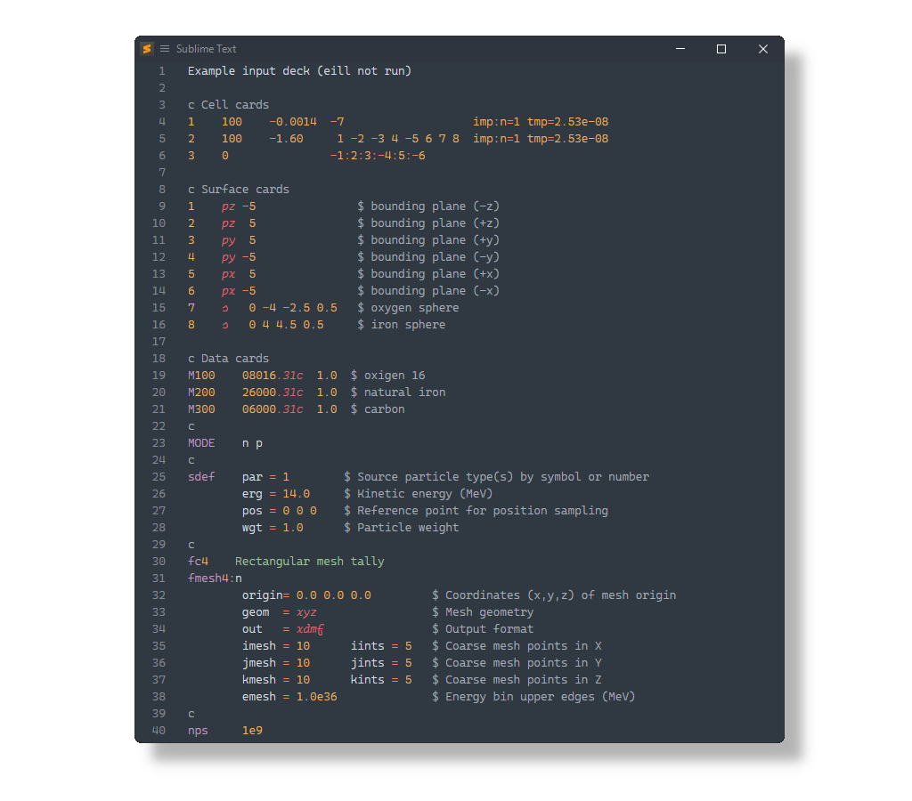

MCNP
===

[MCNP](https://mcnp.lanl.gov/index.html) syntax definitions for [Sublime Text](https://www.sublimetext.com).

## Installation

### Package Control

The easiest way to install is using [Package Control](https://packagecontrol.io). It's listed as `MCNP`.

1. Open `Command Palette` using <kbd>ctrl+shift+P</kbd> or menu item `Tools → Command Palette...`
2. Choose `Package Control: Install Package`
3. Find `MCNP` and hit <kbd>Enter</kbd>

### Manual Install

1. Download appropriate [MCNP.sublime-package](https://github.com/SublimeText/MCNP/releases) for your Sublime Text build.  
2. Copy it into _Installed Packages_ directory

> [!NOTE]
>
> To find _Installed Packages_...
>
> 1. call _Menu > Preferences > Browse Packages.._
> 2. Navigate to parent folder

> [!WARNING]
>
> Manually installed packages are not automatically updated by Package Control.

## Usage

1. Open an `.mcnp` file
2. Select `View > Syntax > MCNP`

## Credits

The syntax definition is ported from https://github.com/repositony/vscode_mcnp
